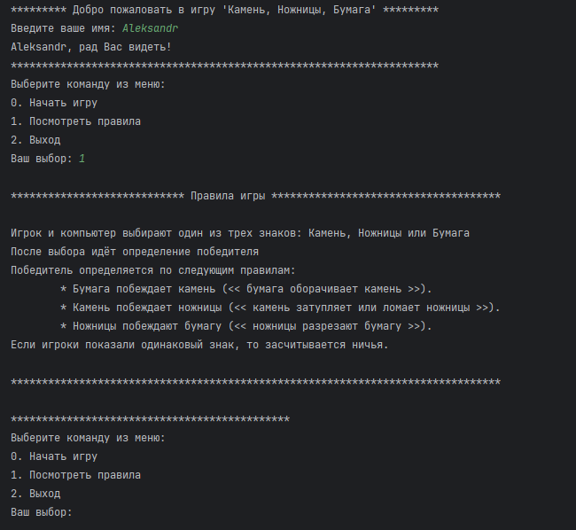

# Проект Rock_scissors_paper

## Оглавление
[1. Описание проекта](README.md#Описание-проекта)  
[2. Что интересного?](README.md#Что-интересного)  
[3. Геймплей](README.md#Геймплей)  
[4. Запуск проекта](README.md#Запуск-проекта)  
[5. Внешний вид запущенного приложения](README.md#Внешний-вид-запущенного-приложения)

### Описание проекта
Игра "Камень, ножницы, бумага" с визуальной частью в консоли.  В роли противника выступает компьютер

### Что интересного?
- Упрощенная визуальная часть приложения
- Меню управления в проекте

### Геймплей
- Пользователь вводит свое имя
- Выбирает команду в меню управления
- Начинается матч (3 раунда)
- Вывод результата после каждого раунда

### Запуск проекта

* Запустить метод main из класса GameRunner находящийся по пути \src\main\java\ru\game\GameRunner.java

### Внешний вид запущенного приложения

